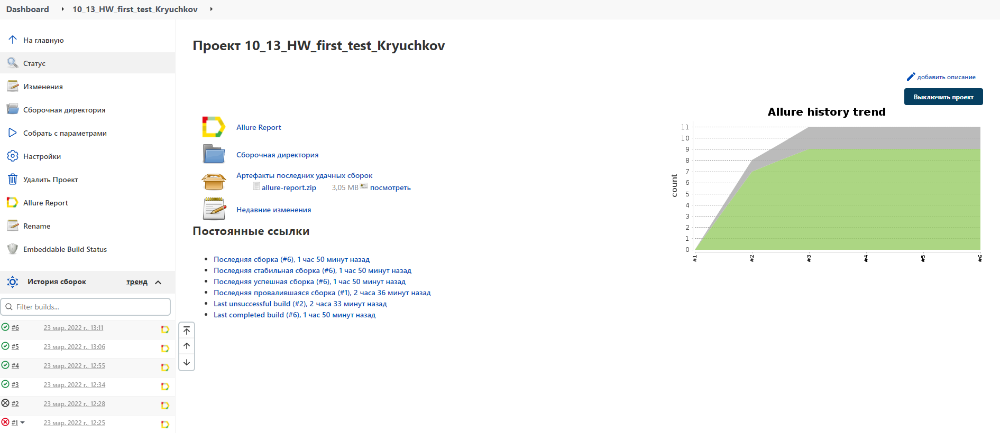
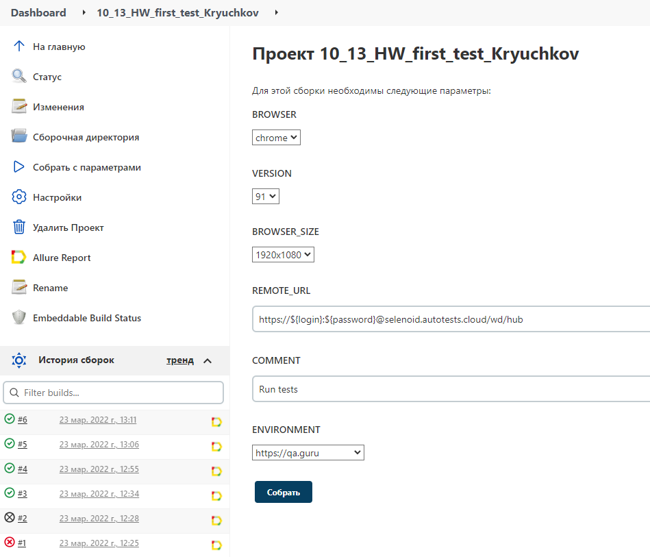
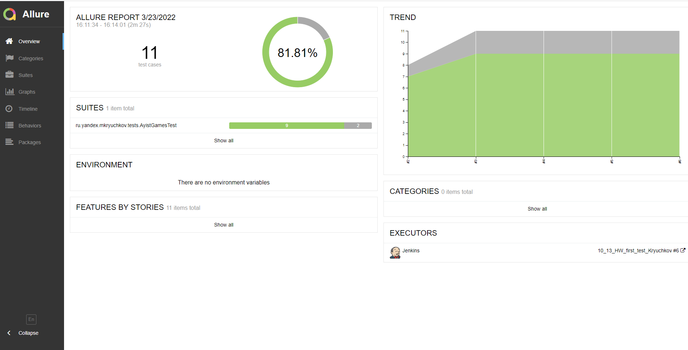
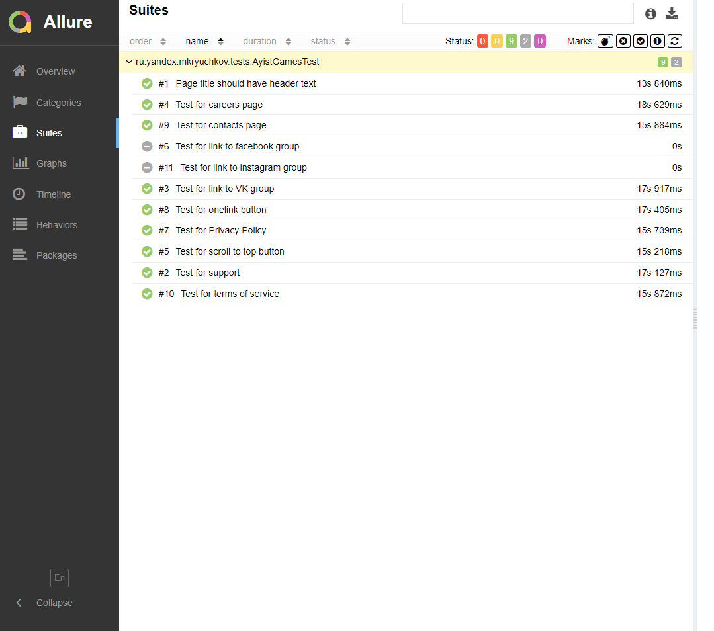
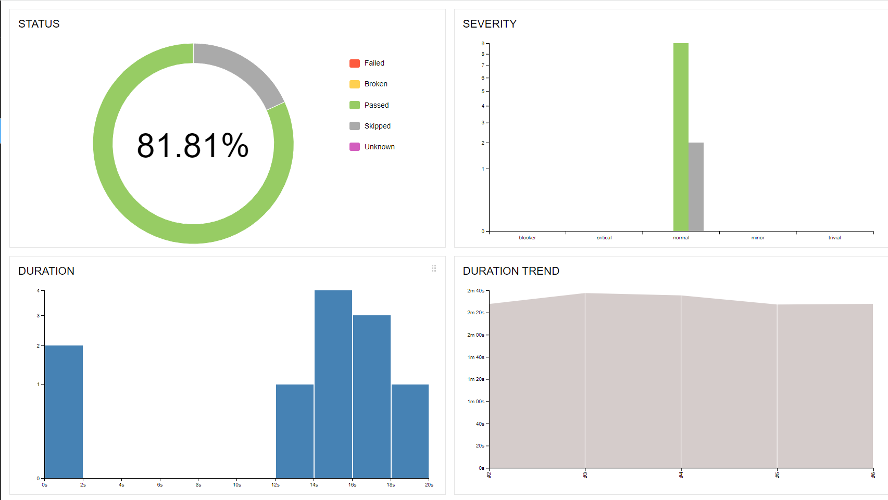
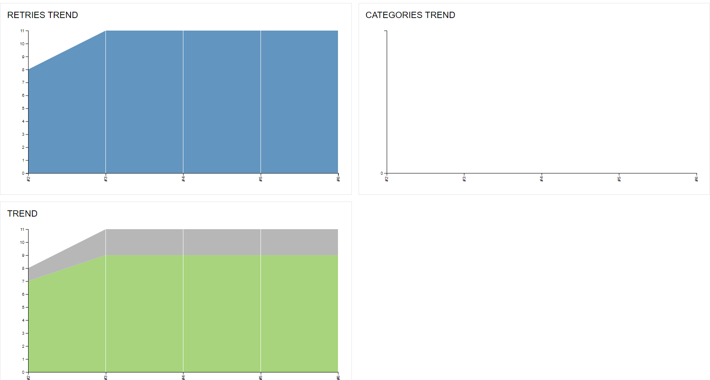
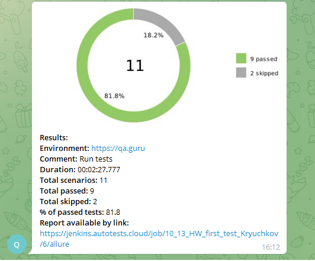
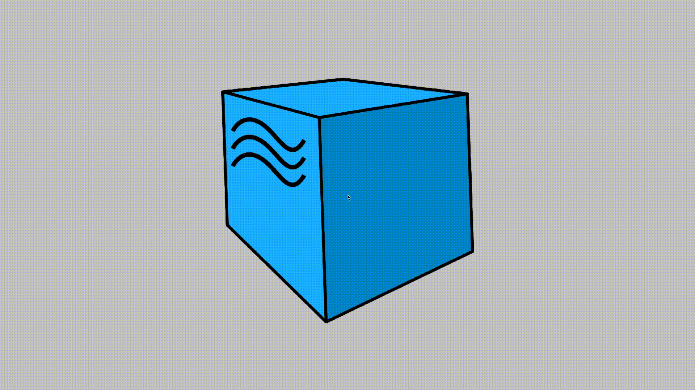

# Автотесты для сайта <a target="_blank" href="https://ayist.games/mainru">Ayist.Games</a>


## ✔️ Реализованы следующие проверки для сайта :

- ✓  Заголовок страницы соответствует заданному
- ✓  На сайте присутствует "Политика Конфидициальности"
- ✓  На сайте присутствует "Условия обслуживания"
- ✓  На сайте присутствует "Поддержка"
- ✓  На сайте присутствует ссылка на группу VK
- ✗  На сайте присутствует ссылка на группу Facebook (temporarily disabled)
- ✗  На сайте присутствует ссылка на группу Instagramm (temporarily disabled)
- ✓  На сайте присутствует onelink ссылка на игру в маркете
- ✓  Кнопка скролла по сайту работает
- ✓  Вкладка "Карьера" на сайте не пустая
- ✓  Вкладка "Контакты" на сайте не пустая  


##  ⚒️  Используемые технологии и инструменты :


## </a> Jenkins <a target="_blank" href="https://jenkins.autotests.cloud/job/10_13_HW_first_test_Kryuchkov/"> job </a>
<p align="center">
<a href="https://jenkins.autotests.cloud/job/10_13_HW_first_test_Kryuchkov/"></a>
</p>

## Можно настроить разные параметры в Jenkins :

- browser (default = chrome)
- version (default =  91.0)
- size (default = 1920x1080)
- remoteUrl (логин, пароль и адрес удаленного сервера selenoid)




## Для локального запуска :
```bash
gradle clean test
```

## Для удаленного запуска с параметрами :
```bash
clean
test
-Dbrowser=${BROWSER}
-Dversion=${VERSION}
-Dsize=${BROWSER_SIZE}
-Durl=${REMOTE_URL}
```
___
## </a> Отчет в <a target="_blank" href="https://jenkins.autotests.cloud/job/10_13_HW_first_test_Kryuchkov/allure/">Allure report</a>

### Overview :


### Suites : 


### Graphs :



#### </a> Отчет в телеграмм о результатах тестов :



### Прохождение каждого теста записывается : 

